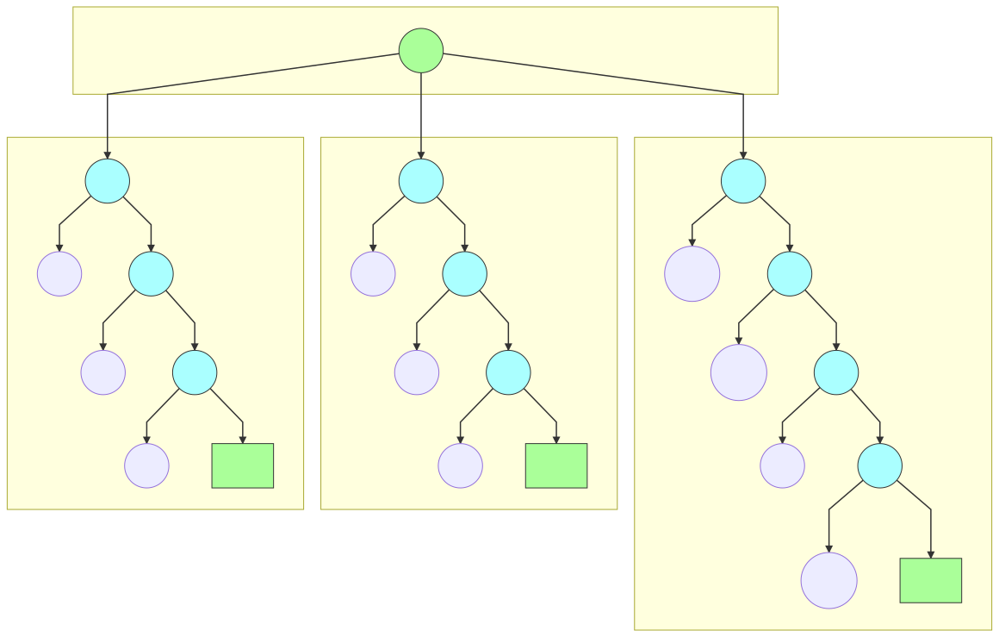

# A brief expalanation of incr-regex

All avaliable regexp packages treat matching as single matching function, for example the javascript built-in regexp, you either matche the entire
regexp or you fail. This package provides a more flexible approach will return one of 4 states

| Status | Description |
| ------ | ----        |
| _DONE_ | String matches completely |
| _OK_  | The regexp matches, but will accept more characters, for example a zip code may be 5 digits or 9 digits  |
| _PARTIAL_ | The regexp matches the string so far but is incomplete, i.e. needs more characters |
| _FAIL_ | The string does not match the regexp |

----

### Example
using the zipcode exmple 

__Reg Expression__ :
_[0-9]{5}-[0-9]{4}_ :

| String | Status |
| ------ | ----   |
| "90" | _PARTIAL_ |
| "90210" | _OK_ |
| "90210-5" | _PARTIAL_ |
| "90210-5003" | _DONE_ |
| "90210-500A" | _FAIL_ |

### The Algorithm

This is a brief explanation of the algorithm. Suppose we have the following regexp _[a-z][0-9]-[0-9]|cat|dog_

we parse the regexp to create the following tree:

We process the the tree to get the following graph:

